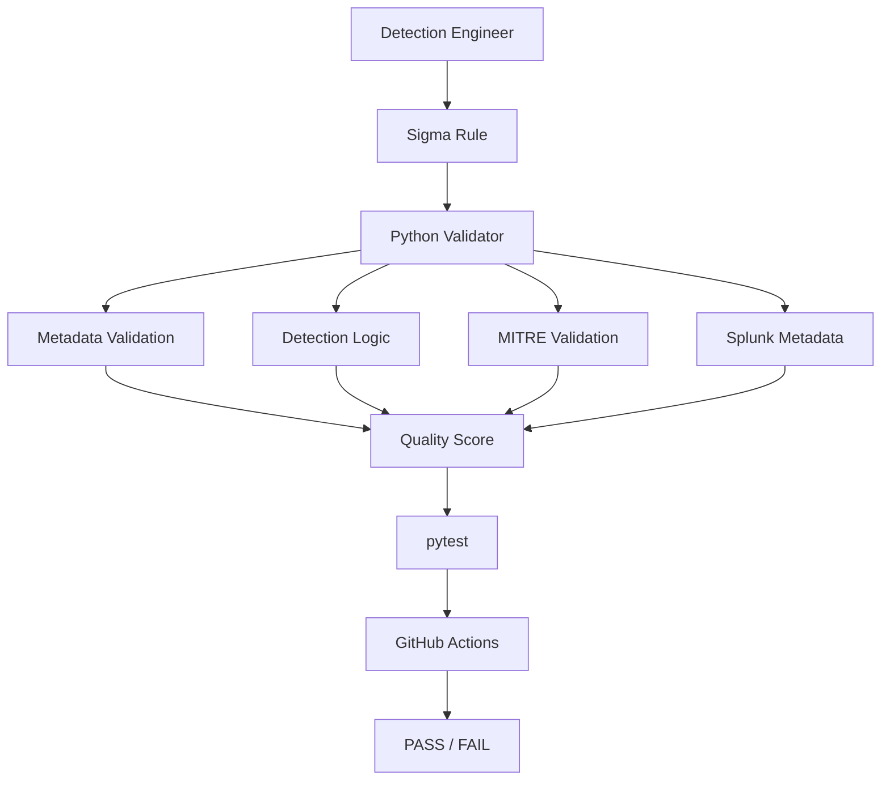

# Architecture

## Overview

The Detection as Code Validation Framework is a static analysis pipeline
for Sigma detection rules. It has no runtime dependency on a SIEM, cloud
account, or external service. Every check runs locally against YAML files
in the repository.

## Data Flow

## Components

### `validator/rule_validator.py`
The orchestration layer. Discovers `*.yml`/`*.yaml` files under a target
directory, parses each with `yaml.safe_load`, and calls each specialized
validator module in sequence. Also owns UUID format validation and
cross-repository duplicate ID detection, since both require visibility
into every rule at once rather than a single rule in isolation.

### `validator/metadata_validator.py`
Checks the presence of every required Sigma field, validates `status`
against the allowed lifecycle values, validates `level` against the
allowed severity values, and checks that `logsource` contains at least
one of `category`/`product`/`service` with real content.

### `validator/detection_validator.py`
Validates the `detection` block: that a `condition` exists and is
non-empty, that at least one selection is defined, that no selection is
empty, and that every identifier referenced in the condition string
(including `1 of x*` / `all of x*` wildcard patterns) resolves to a real
selection. This is a lightweight, regex-based checker rather than a full
Sigma condition grammar implementation — see "Limitations" in the README.

### `validator/attack_validator.py`
Validates the format of `attack.tXXXX` / `attack.tXXXX.XXX` tags and
extracts normalized technique IDs (e.g. `T1059.001`) for use in coverage
reporting. It does not validate technique IDs against the live MITRE
ATT&CK dataset.

### `validator/splunk_validator.py`
Validates the optional `x_splunk` metadata block: `data_model` presence,
`query_type` against an allow-list (`search`, `tstats`, `transaction`),
and that `fields`, when present, is a list of non-empty strings. This is
static metadata validation, not SPL parsing or execution.

### `validator/coverage.py`
Aggregates `attack_techniques` across all validated rules into a
repository-level MITRE ATT&CK coverage summary: total rules, unique
techniques, per-technique rule counts, and rules with no ATT&CK mapping.

### `validator/models.py`
Shared dataclasses: `ValidationIssue`, `QualityScore`, `RuleResult`, and
`RepositoryResult`. Keeping these in one module avoids circular imports
between the validator submodules.

### `scripts/validate.py`
The CLI entry point. Wraps `rule_validator.validate_repository()` and
renders either a human-readable text report or a `--json` machine-readable
report for CI consumption. Exit code is `0` when the repository passes
and `1` when any rule or duplicate-ID check fails.

## Why Split Validators Into Separate Modules?

Each validator module maps to one row in the CLI's "Validation:" summary
(Metadata / UUID / Detection Logic / ATT&CK / Splunk). Keeping them
separate makes it possible to test each concern in isolation, and makes
it obvious where to add a new check without touching unrelated code —
mirroring how a real detection-engineering team would split ownership of
rule quality gates.
